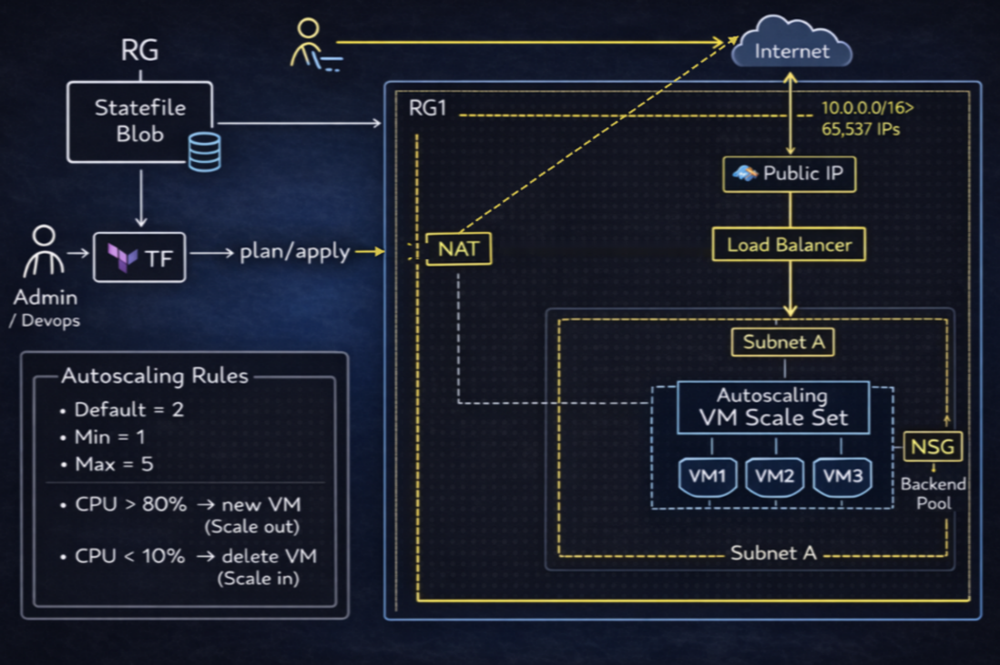

# Advanced Azure Infrastructure with Terraform

Build a scalable Azure web application stack using Terraform: a VM Scale Set behind a Load Balancer, with secure networking and autoscaling.

## Assignment Overview
You will create infrastructure that includes:
- A resource group in an approved region with a validation rule.
- A VNet with two subnets and a locked-down NSG.
- A VM Scale Set with environment-based sizing and autoscaling.
- A public Azure Load Balancer with health probes.

## Requirements

### Base Infrastructure
- Create a resource group in **one** of these regions:
  - East US
  - West Europe
  - Southeast Asia
- Add a validation rule that restricts other regions.

### Networking
- Create a VNet with two subnets:
  - Application subnet (for VMSS)
  - Management subnet (for future use)
- Configure an NSG that:
  - Only allows traffic from the load balancer to the VMSS
  - Uses **dynamic blocks** for rule configuration
  - Denies all other inbound traffic

### Compute
- Set up a VMSS with:
  - Ubuntu 202.04 Jammy
  - VM sizes based on environment (use `lookup`):
    - Dev: `Standard_B1s`
    - Stage: `Standard_B2s`
    - Prod: `Standard_B2ms`
- Configure autoscaling:
  - Scale in when CPU < 10%
  - Scale out when CPU > 80%
  - Min instances: 2
  - Max instances: 5

### Load Balancer
- Create an Azure Load Balancer with:
  - Public IP
  - Backend pool connected to the VMSS
  - Health probe on port 80

## Technical Requirements

### Variables
Create a `terraform.tfvars` file with:
- Environment name
- Region
- Resource name prefix
- Instance counts
- Network address spaces

### Locals
Implement locals for:
- Common tags
- Resource naming convention
- Network configuration

### Dynamic Blocks
Use dynamic blocks for:
- NSG rules
- Load balancer rules
